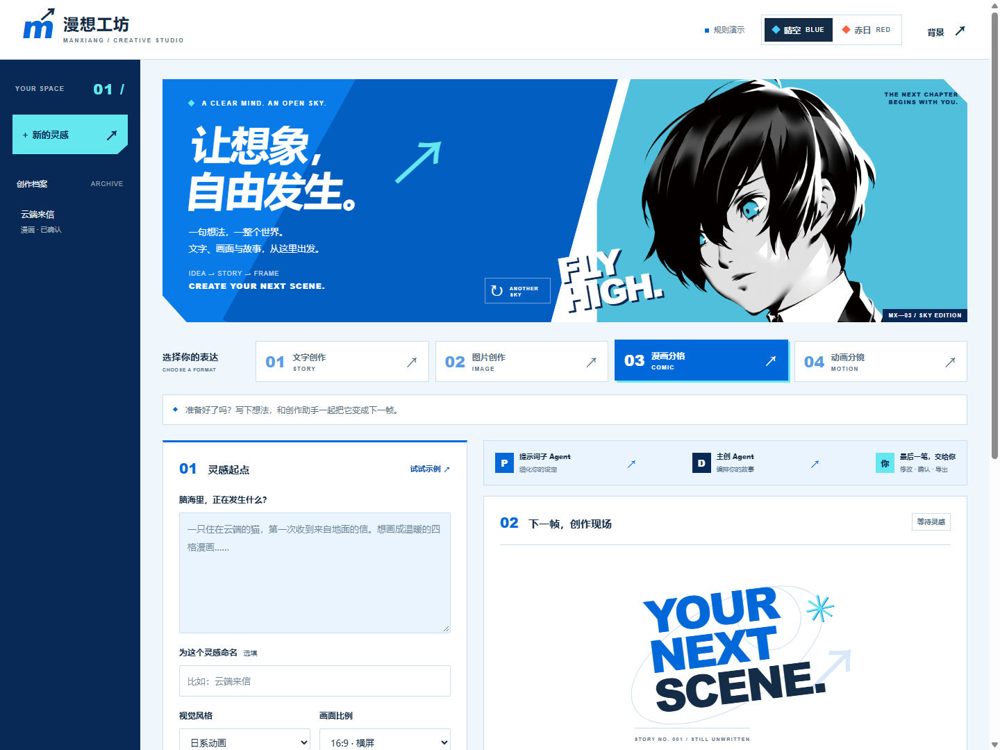
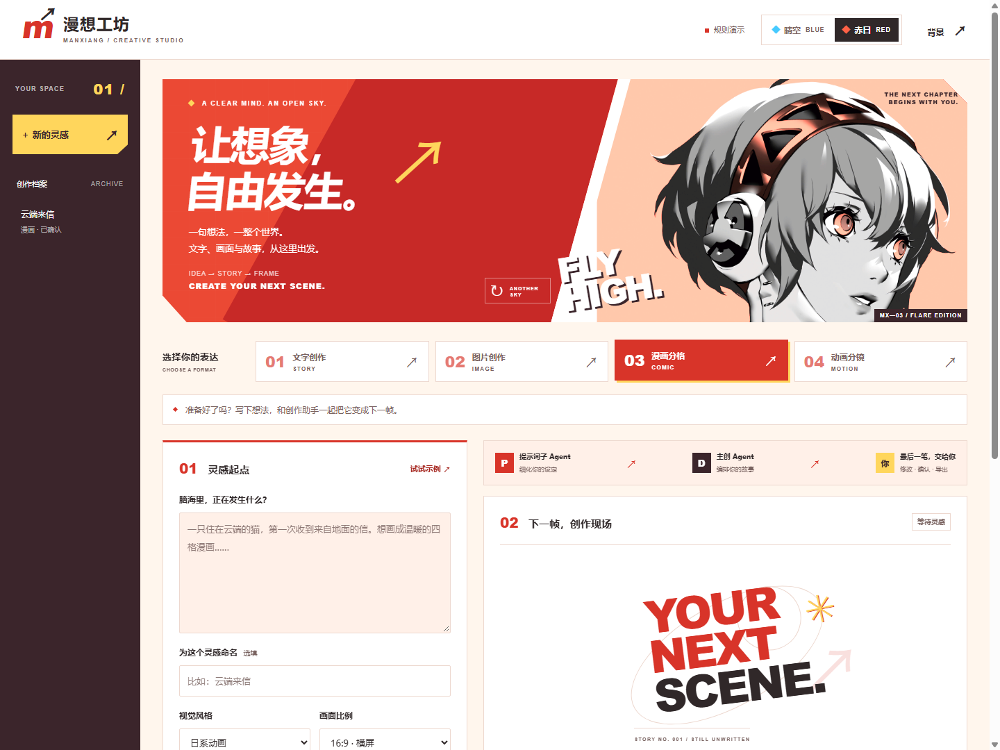

# 漫想工坊

**从一句想法，到可以保存的插画与四格漫画。**

面向校园内容创作者的 Agent 工作台：提示词子 Agent 整理设定，主创 Agent 编排内容，用户确认后调用万相绘图。支持 DeepSeek、可扩展创作 Skills、角色参考图和动漫背景。原“一页创作”项目仍可打开与导出。

**团队从这里开始：[文档导航](docs/README.md) · [开发指南与文件地图](docs/development-guide.md) · [三人分工](docs/team-plan.md) · [后端接口交接](docs/backend-handoff.md)**

| 晴空 / SKY | 赤日 / FLARE |
| --- | --- |
|  |  |

界面截图来自不计费的练习模式；角色皮肤使用用户提供素材，[来源说明](docs/qa/asset-register.md)。


上图为本项目通过 DeepSeek + 百炼 `wan2.7-image` 实际生成的 1280 × 720 PNG，非界面占位图。见 [样例记录](docs/examples/README.md)。

## v0.4 能做什么

| 类型 | 可交付内容 |
| --- | --- |
| 文字 | 正文、提纲，TXT / JSON |
| 图片 | 精细提示词、真实插画，PNG |
| 漫画 | 四格脚本、逐格图片、2 × 2 合成 PNG；后续格可参考第一格角色 |
| 动画 | 三个五秒镜头的分镜脚本；尚无视频生成 |

每阶段可以检查、修改。修改设定后旧确认失效，旧图片保留并标注版本。真实生图按张确认；重复点击不会自动重复提交；断网后保留任务，下载失败只重试下载。

新版界面支持“晴空 / 赤日”两套角色主题，记住配色选择，允许随机变换装饰构图。当前项目标题、版本、档案高亮和阶段导航帮助快速找到设定、创作稿与图片。样式参考与素材来源见 [视觉系统](docs/design-system.md)。

## 本机启动

需要 Node.js 22+，无需安装第三方依赖。Windows 可双击 `start.cmd`，或运行：

```powershell
npm start
```

打开 [本机工作台](http://127.0.0.1:3000)。没有密钥也能选择“规则演示”试完整创作稿流程；规则演示不具备模型推理能力。

队友无密钥练习、测试完整图片流程时可运行：

```powershell
npm run dev:mock
```

打开 [练习工作台](http://127.0.0.1:3100)。它不读取 `.env`，不调用付费接口，所有图片使用同一张示例素材；页面明确标注模拟模式。数据单独保存在 `data-mock/`，不会混进真实项目。初学者可照着 [人工测试清单](docs/qa/manual-checklist.md) 开始工作。

要使用真实模型，首次复制 `.env.example` 为 `.env`，仅在本机填写密钥，重启服务：

```dotenv
DEEPSEEK_API_KEY=你的DeepSeek密钥
DEEPSEEK_MODEL=deepseek-flash
DEEPSEEK_BASE_URL=https://api.deepseek.com
DASHSCOPE_API_KEY=你的百炼北京地域密钥
DASHSCOPE_IMAGE_MODEL=wan2.7-image
DASHSCOPE_BASE_URL=https://dashscope.aliyuncs.com/api/v1
```

使用百炼工作空间专属地址时，将最后一项替换成该空间的 `https://工作空间.cn-beijing.maas.aliyuncs.com/api/v1`。这里使用 **DashScope 原生地址**，不是 `compatible-mode/v1`。当前适配 `wan2.7-image` / `wan2.7-image-pro`，模型权限以账户为准。

DeepSeek 负责文字与规划，百炼负责图片，两者独立配置、独立计费。即使文案选择规则演示，点击生图仍是真实 API 调用。后端读取密钥，前端只收到是否配置的状态，`.env` 不提交 Git。

## 第一次生成图片

1. 选择“图片创作”或“漫画分格”，填写想法、风格、比例与 Skills，创作引擎选择 DeepSeek。
2. 点击“让提示词更精准”，检查子 Agent 的补充设定、角色特征与限制。
3. 确认提示词，交给主创 Agent；可编辑逐格画面和对白，再确认作品草稿。
4. 在图片区域选择画面，勾选单张费用确认，生成并等待预览。可下载本地保存的 PNG。
5. 漫画第一格满意后，后续格默认使用它作为角色参考；四格生成齐全后下载合成漫画。

对白保留在创作稿中，当前合成 PNG 不排版文字气泡。每次重新生成会新建付费任务；不自动批量生成四张。可关闭网页，之后从项目记录恢复查询。

## Agent、Skills 与背景

提示词子 Agent 使用独立上下文返回结构化设定；主创 Agent 通过 `save_creative`、`review_creative` 工具完成有界循环。模型阶段有次数和超时限制，失败不会伪装成成功。工程细节见 [核心算法与编排](docs/core-algorithm.md)。

内置漫画连续性、动画镜头、画面构图三个指令包。漫画包适配自 MIT 开源 baoyu-comic，保留来源和许可。添加本地 `SKILL.md` 后注册即可扩展；每个项目留存内容及 SHA256，详见 [扩展说明](creative-skills/SOURCES.md)。不执行第三方脚本。

右上角“背景设置”支持本机图片临时预览。永久背景配置在 `public/theme.json`，素材放 `public/assets/`；见 [背景配置](public/assets/README.md)。

## 验证与材料

```powershell
npm test
```

自动测试不需要 API Key，也不产生模型费用。真实单图联调、模拟四格浏览器测试和未验证范围分别记录于 [测试报告](docs/test-report.md)，避免混用测试结论。

- [软件说明与故障处理](docs/software-description.md)
- [架构与版本范围](docs/agent-prototype.md)
- [核心算法与编排](docs/core-algorithm.md)
- [参赛材料清单](docs/submission-checklist.md)
- [四分钟演示脚本](docs/demo-script.md)
- [用户试用与对照评估计划](docs/evaluation-plan.md)

面向 AIC“AI+软件创新”准备材料，目前是可运行的本地版本。报告源稿已提供；正式视频、答辩 PDF、用户试用数据需据实制作，未宣称已完成赛事提交或取得奖项。

## 运行边界

数据与图片保存在忽略 Git 的 `data/`。备份时同时备份项目 JSON 和 `data/images/`。服务只监听 `127.0.0.1`，适用于单人单进程；没有登录、多人权限、公共任务队列或在线部署。`PORT`、`DATA_DIR` 可配置。

图片服务已提供可注入的适配接口，定义在 `lib/image-provider.d.ts`；HTTP 契约、失败状态和后端队友的接手任务见 [后端交接](docs/backend-handoff.md)。当前图片查询由网页驱动，服务端后台查询调度仍是后续任务。

角色参考改善约束传递，但不保证每次外观完全一致。当前结构检查不等于画面质量评分。没有训练自有基础模型，外部推理依赖网络、账户余额和模型服务。

接口依据：[DeepSeek JSON](https://api-docs.deepseek.com/zh-cn/guides/json_mode/)、[工具调用](https://api-docs.deepseek.com/zh-cn/guides/tool_calls/)、[万相图像 API](https://help.aliyun.com/zh/model-studio/wan-image-generation-and-editing-api-reference)。
