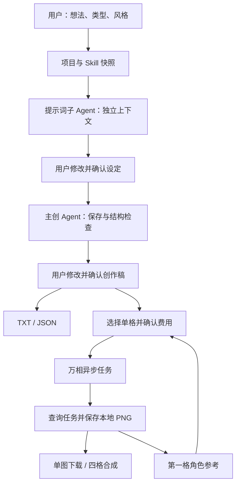

# 架构与版本范围

v0.6 使用 React + TypeScript + Tailwind 构建创作工作台，聚焦校园社团插画与四格故事，从设定整理到真实图片下载形成完整流程，支持红蓝角色主题、项目阶段导航、离线练习、用户上传角色参考与默认折叠提示词。文字与动画分镜保留为辅助能力；动画视频不属于本版已完成功能。

| 模块 | 实现与职责 |
| --- | --- |
| 界面 | React + TypeScript，Vite 构建，Tailwind 布局与定制视觉 CSS；Canvas 合成 |
| API | Node.js 原生 HTTP；本机访问、版本检查、项目锁 |
| 子 Agent / 主创 | `lib/studio.mjs`；DeepSeek 或 Ollama；规则模式用于无密钥演示 |
| 文本提供方 | `lib/providers.mjs`；JSON 和工具消息适配 |
| 图片服务 | `lib/images.mjs`；百炼原生异步接口、任务持久化与恢复 |
| 存储 | `lib/store.mjs`；本机 JSON 原子替换；PNG 文件 |
| Skills | `lib/skills.mjs`；本地白名单、长度与类型检查、内容快照 |

两个 Agent 是职责、上下文和模型调用分离，不是两个常驻进程。子 Agent 没有执行工具；主 Agent 只有保存与检查两个工具，不能运行命令或任意访问网络。图片服务由人确认后通过确定性程序调用。

新项目使用 schemaVersion 2。每次改变设定或作品产生新 revision；生成任务绑定 revision 和画面编号。旧图片可查阅，但不会自动算进新版本的四格成品。旧 schemaVersion 1 校园活动项目继续使用原有导出。

本版已实现角色参考、单格重生成、PNG 保存、四格合成、下载失败恢复和未知提交任务找回。下一步优先完成真实四格质量评估、对白排版与用户试用；再依据需求决定视频适配和多人部署。
