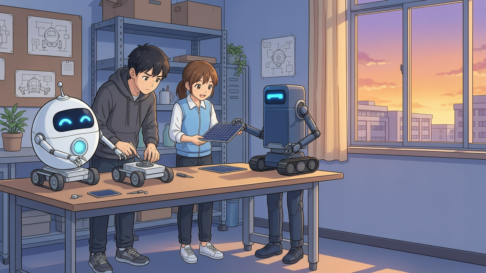

# 真实联调样例

`interface-sky.png` / `interface-flare.png` 是 v0.4 界面的练习模式截图，使用用户提供的角色皮肤。它们展示 UI，不代表图像模型生成的角色；素材来源见 [登记表](../qa/asset-register.md)。

`campus-demo.png` 是本项目在 2026-09-26 通过真实图片接口生成并下载的 1280 × 720 插画。题材为虚构机器人社团，无学校名称或现有动漫角色设定。

`campus-demo.json` 仅保留该次运行的原始设定、优化设定、创作稿、Skill 来源摘要、执行步骤及图片文件摘要，不含 API Key、工作空间地址或临时签名下载链接。模型为 DeepSeek `deepseek-flash` 与百炼 `wan2.7-image`。

这是一张实际结果，用于证明单图调用与保存流程。它不是四格漫画质量评估，也不是多个用户的试用案例。更换提示词或重复生成可能得到不同图像。
